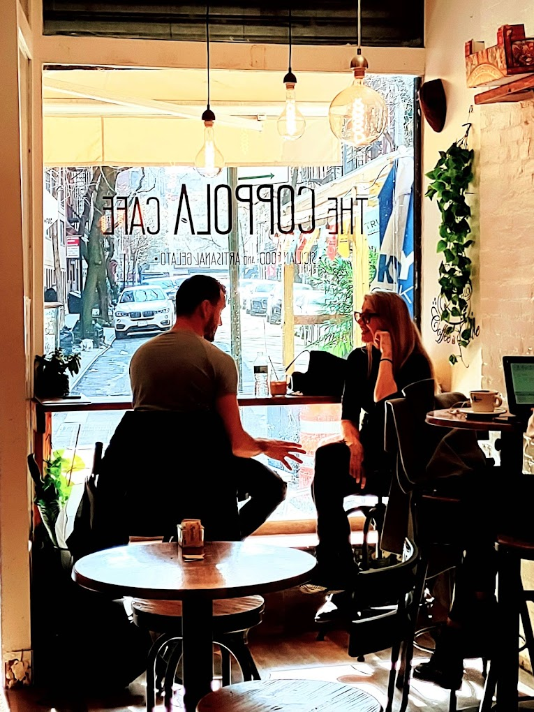

Comment on your small contributions: how are things going, what types of contributions were you able to make? what are the biggest challenges? which contribution are you most proud of?

## Progress

It has now been six or so weeks since starting my journey. Over these past few weeks I have learned more about open source software development than I had previously thought attainable in such a small time period. After learning more about git, licenses, conduct, and the community I believe I will soon be able to make actual contributions to code. for now, I am proud of the small contributions I have been able to make.

<!--more-->

### OpenStreetMap
------

So far, I have focused on making small contributions to OpenStreetMap. Like most people I chose to start with the familiar. I scanned OpenStreetMap points and building in my neighborhood and from there I went about updating businesses and addresses that I, and therefore others, patronize often. For example, I noticed that OpenStreetMap was missing a prominent cleaners that had been in business over 10 years. I made sure to also delete any points I knew to be no longer existent. I also added 3 cafes that I knew to be notable locally. These cafes are not just coffee shops they are community staples which is why I was surprised to learn that they were missing.[^1]

    

<h3 align="center">The Coppola Cafe</h3>

    

<h3 align="center">OpenStreetMap Entry</h3>

### Wikipedia
------

My next few small contributions were made to Wikipedia. Again, I wanted to make contributions that heavily reflected my own interests. Over the last few years I occasionally take Italian culture classes at New York University Casa Italiana building, a beautiful brownstone located on West 12th Street and 5th Avenue. While roaming on OpenStreetMap I noticed that the Casa Italiana Building was missing I added it to OpenStreetMap and then discovered the reason it wasn't originally listed as such is because it is considered a historical building and also known as the "General Scott Winfield House". While looking at the Wikipedia page for Casa Italiana, I noticed that the rich history of the building was missing and so I added a bit more context.[^2]

    

<h3 align="center">Casa Italiana</h3>

Because it is Oscar season, my next 2 contributions focused on movies that I really appreciated this year, ["The Monkey" (2025)](https://en.wikipedia.org/wiki/The_Monkey_(film)) and ["The Substance" (2025)](https://en.wikipedia.org/w/index.php?title=The_Substance&action=history). I went about updating the cast list of both of these movies to credit the amazing actors and actresses who worked in these films. I double checked with [IMDB](https://www.imdb.com/?ref_=nv_home) and added anyone notable who I felt had been mistakenly left out. These two contributions are the ones that were the most challenging. These pages get a lot of attention so it seemed as soon as I could make an edit, another user would slightly change it. While I appreciate this due diligence, the changes didn't always seem relevant. Another issue I faced was with the ["The Substance" (2025)](https://en.wikipedia.org/w/index.php?title=The_Substance&action=history) page as it had a lock on editing due to heavy traffic. I had to make a detailed edit request, and after the request was made and approved a moderator made the edit for me. Nevertheless, I think that I enjoyed these contributions the most, even though they were small it was exciting to be apart of such an active and invested community.

***

[^1]: Image attributed to [The Coppola Cafe](https://www.google.com/maps/contrib/112024323214515231659/photos/@40.7323234,-74.0015222,17z/data=!3m1!4b1!4m3!8m2!3m1!1e1?entry=ttu&g_ep=EgoyMDI1MDIyNi4xIKXMDSoASAFQAw%3D%3D).
[^2]: Image attributed to [Casa Italiana Website](https://www.casaitaliananyu.org/about-us/our-story/)
