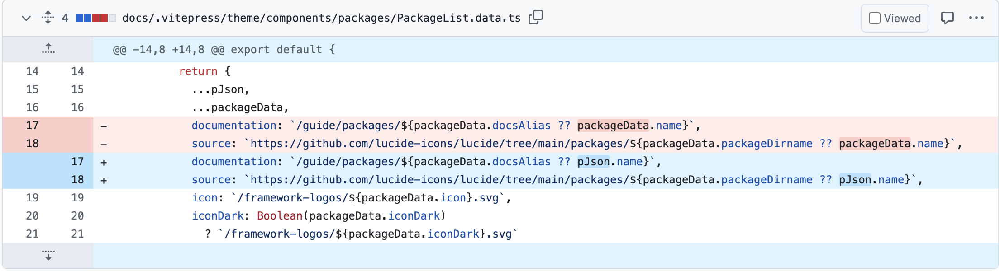

## Lucide
------

For the last couple of weeks, I along with my group have been diligently working on contributing to [Lucide](https://github.com/briz123/lucide) an open source icon toolkit. Although, our progress has been slow, I feel we have succeeded in finding our rhythm as a group and on developing new ideas on how best to advance this project.

<!--more-->

### Current Progress
------

So far we have focused on creating points of contact with the community and establishing ourselves as a group that is interested in further development. One way we have done that is by creating new icons by making svg files. This has been more of a struggle than expected as it involves a fair bit of both math and creativity but we have been able to make some beautiful icons:

```
  <svg
  xmlns="http://www.w3.org/2000/svg"
  width="24"
  height="24"
  viewBox="0 0 24 24"
  fill="none"
  stroke="currentColor"
  stroke-width="2"
  stroke-linecap="round"
  stroke-linejoin="round"
  >
  <path d="m10.09 22.5-.95-7.64a2.87 2.87 0 0 0-5.73 0l2.86 7.64h11.46l2.86-7.64a2.87 
  2.87 0 0 0-5.73 0l-.95 7.64" />
  <path d="M10.09 4.36h.26" />
  <path d="M13.91 4.36h-.26a3.82 3.82 0 0 1 3.82 3.82" />
  <path d="M14.81 15.46a4 4 0 0 0 0-.59 1 1 0 0 0-5.72 0 4 4 0 0 0 0 .59h0" />
  <path d="M17.73 8.18v.17a2.86 2.86 0 0 1 1.91 2.7V13" />
  <path d="M4.36 13v-1.9a2.86 2.86 0 0 1 1.91-2.7A3.82 3.82 0 0 1 10 4.18" />
  <circle cx="12" cy="3.41" r="1.91" />
</svg>
```

Created by me translates to:
<p align="center">
    
</p>
<h3 align="center">Cupcake!</h3>

In order to maintain contact we have also emailed the creator and are soon hoping to get a response. We felt that this was a good way to introduce ourselves and not seem too intrusive.

### Personal Code Contributions
------
As for my personal code based contributions to the project, I noticed that there was a missing image on their github repo website due to not a broken link but a width issue. I was able to open an [issue](https://github.com/lucide-icons/lucide/issues/2887), then once I received permission I opened a [Pull Request](https://github.com/lucide-icons/lucide/pull/2889) which was then merged into the code base. 

As for my next code bug based issue I noticed while perusing their website that when I clicked on a package supported by Lucide I was being redirected at an undefined package resulting in a 404. I created an [issue](https://github.com/lucide-icons/lucide/issues/2980) and awaited more feedback as it did not seem as simple as a broken link. This was interesting because it got a bit more traction than some of my previous issues as some could recreate the issue while others could not. From there, I looked at previous commits as it seemed recent. I saw how there was a lot of changed files and using that and a very helpful comment, I could focus on a specific file `docs/.vitepress/theme/components/packages/PackageList.data.ts` where the names of packages where being pulled from the wrong place. After getting familiar with the relevant code and the testing/development environment I was able to open a [Pull Request](https://github.com/lucide-icons/lucide/pull/2983) that was then approved. The most interesting part of this for me was despite how the fix was so simple, how time-consuming it is to identify exactly where the problem was coming from. Sometimes playing around seems wasteful but it really aids the learning process.

<p align="center">
    
</p>
<h3 align="center">Diff</h3>

### Future Ideas and developments
------
We have discussed several ideas for future contributions and so far plan to:

- Create a few new icons
- Extend the project to a new framework
- Reduce redundant categories on website
- Continue to fix open issues
- Add guide to Lucide Studio on Docs

### Presentation 
------
I wanted to briefly comment on the presentation given by Shivam Balikondwar. Balikondwar, as a grad student at NYU Courant, added a refreshing take on open source development. I enjoyed his presentation as its always interesting to hear from those who starting contributing in the last few years as their experience differs from those who have long-term experience. He spoke about his time contributing to FireFox, Chromium, Linux, etc. I thought that his background in Engineering rather than Computer Science was a boon to his contributions as I noticed he was focused on what seemed to be backend focused contributions although he is a full-stack developer. I appreciate him coming to us and especially how he mentioned a few companies that might have opportunities available.